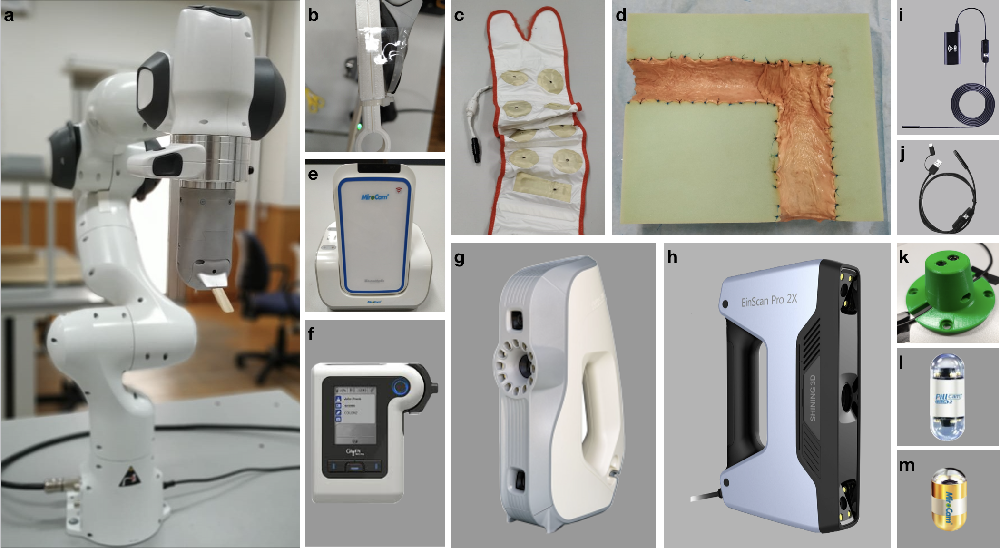
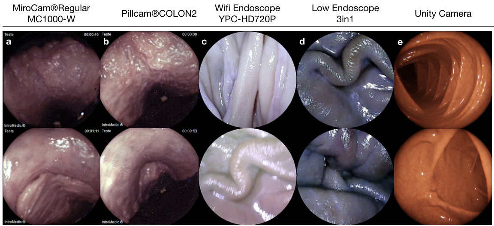
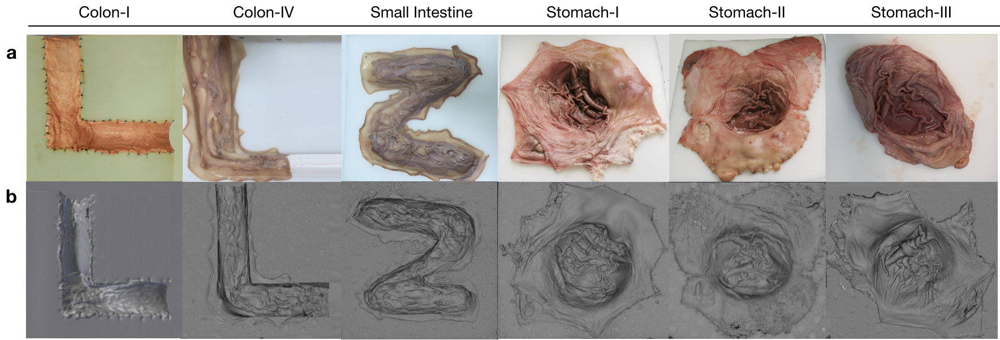
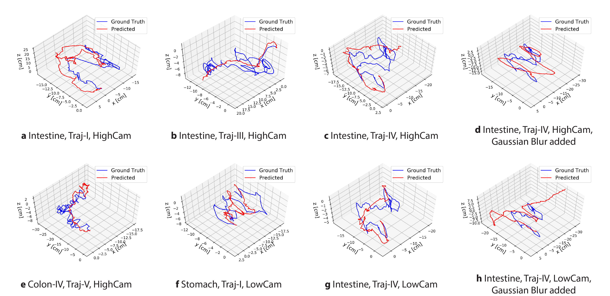
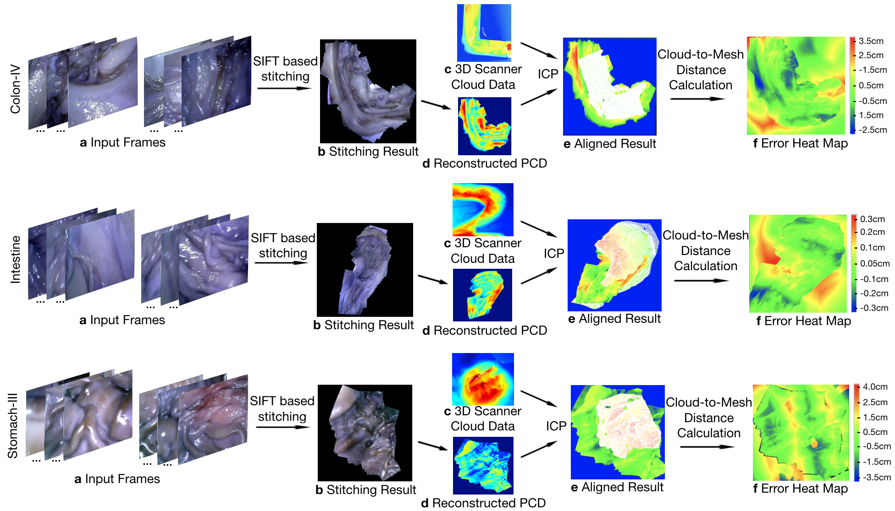
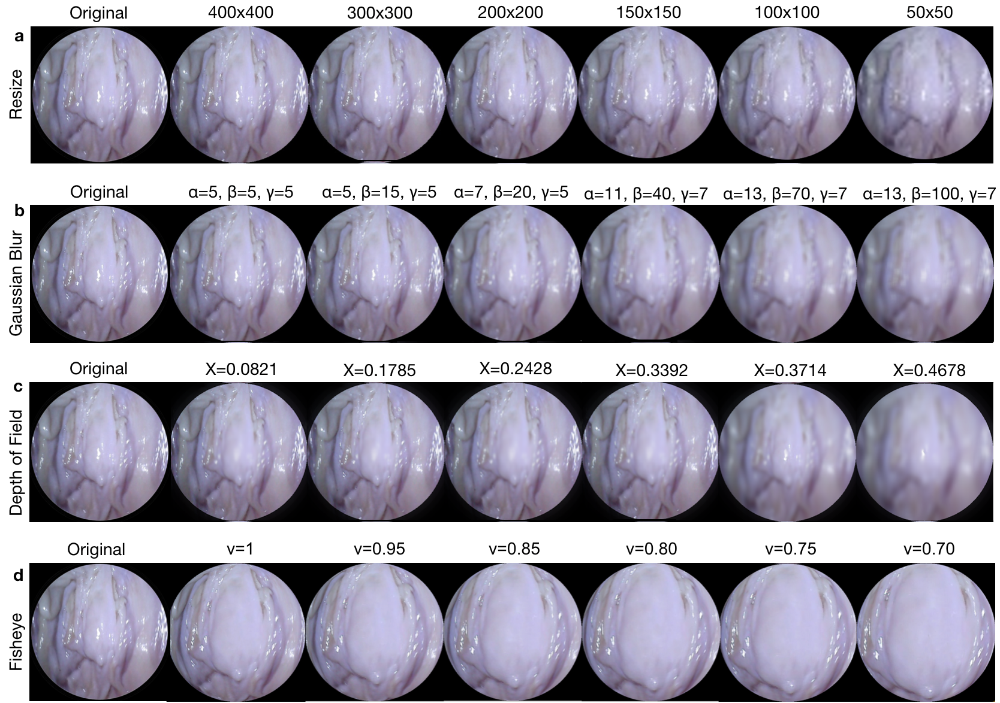
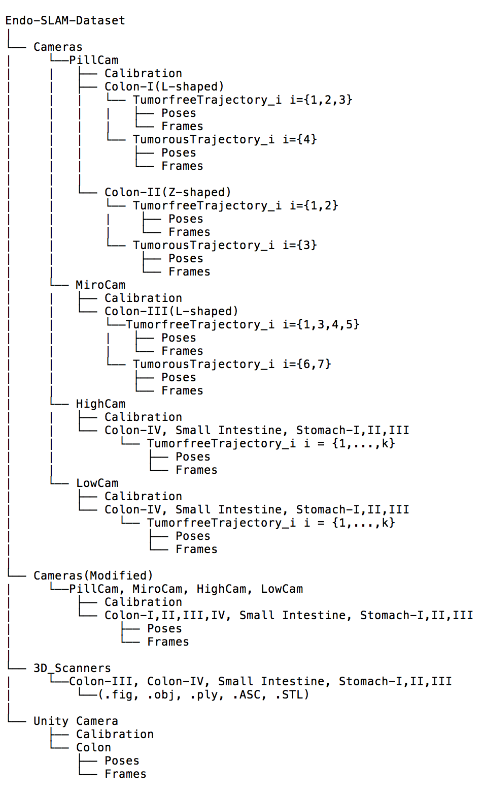
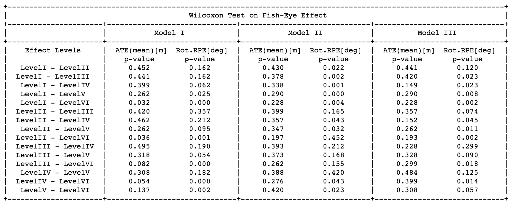
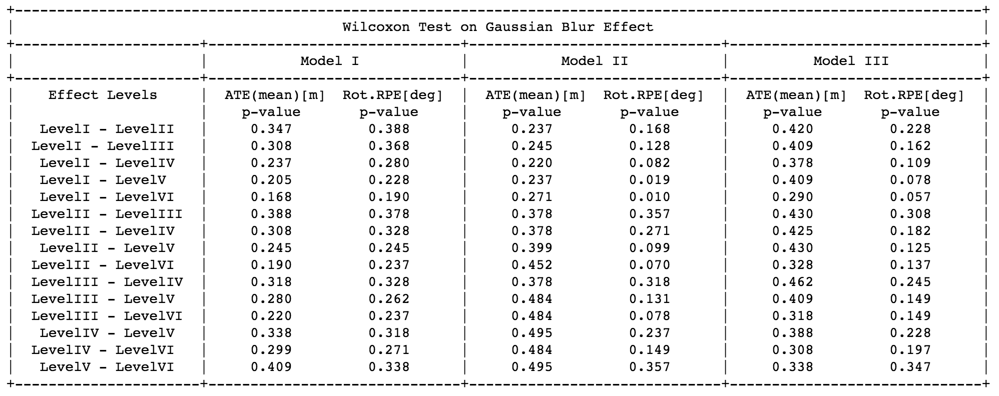

# Endo-SLAM Dataset
In this repository, endoscopy image dataset and the codes to manipulte these images and how these modifications affect the visual odometry algorithms will be introduced. 

<p align="center">
  
</p>

If you use this code and dataset, please cite:

>    Kutsev Bengisu Ozyoruk, Kagan Incetan, Gulfize Coskun, Guliz Irem Gokceler,  Yasin Almalioglu, Faisal Mahmood, Nicholas J. Durr, Eva Curto, Luis Perdigoto, Marina Oliveira, Helder Araujo, Henrique Alexandrino, Mehmet Turan. "Quantitative Evaluation of Endoscopic SLAM 
Methods: ENDO-SLAM Dataset.". 

## Overview

We introduce a comprehensive endoscopic SLAM dataset containing both capsule and standard endoscopy recordings. In total, 35 sub-datasets are provided: 18 sub-datasets for colon, 12 sub-datasets for stomach and five sub-datasets for small intestine, while four of these contain polyp-mimicking elevations carried out by an expert gastroenterologist.

The dataset is publicly available in [DropBox](https://www.dropbox.com/sh/l8n581q0ia97u31/AACDzAkd1Zlb3KY6dVarOMw8a?dl=0) and a video demonstrating the experimental setup and procedure is available on [YouTube](https://www.youtube.com/watch?v=G_LCe0aWWdQ)

### Contributions

The experimentally collected dataset is designed to meet the following major requirements for scientific research and development of endoscopic SLAM methods:
  - Time-synchronized, ground-truth 6 DoF pose data
  - High precision, ground-truth 3D reconstructions
  - Multiple organs from multiple individuals
  - Images from cameras with differing optical properties
  - Image sequences with differing native frame rates
  - A variety of lighting conditions
  - Distinguishable features of diagnostic significance (e.g. presence/absence of polyps)
  
### Equipment

The equipment employed during generation of the dataset from eight ex-vivo porcine GI-tract organs as following:

<p align="center">
 
</p>

**a** Franka Emika Panda: robotic arm employed as motion device. **b** Capsule Holder: special production two-piece holder used as a medium between the WCE cameras and the robotic arm. **c** MiroCam Data Belt PillCam capsule endoscope **d** Real Porcine Colon: sewn onto an 'L' shaped semi-cylindrical scaffold in high-density foam. **e** MiroCam MR1100 receiver: Digital video grabber that converts analog data from receiver into digital to computer. **f** PillCam recorder **g** Artec Eva: 3D scanner used to generate ground truth - ply file.  **h** EinScan Pro 2X: 3D scanner used to generate ground truth - .ply, .obj, .stl and .ASC file. **i** Wireless Endoscope Camera (YPC-HD720P): high resolution - 1280×720 and HD640×480.  **j** Endoscope 3 in 1 Camera: low resolution - 640×480. **k** Camera Holder: special design one-piece holder for the high and low resolution endoscope cameras used to fixed on the robotic arm. **l** PillCam COLON2: WCE double tip camera. **m** MiroCam Regular MC1000-W: WCE camera employed to capture frames from real porcine stomach and send to receiver. 

### Collection of frames taken on endoscope trajectories

The ex-vivo part of dataset consists of a total of 42,700 frames. Of these, 21,428 images are from the HighCam, 17,978 images are from the LowCam, 239 images are from the PillCam and 3,055 images are from the MiroCam. Illustration of recorded frames are as following:

<p align="center">
 
</p>

**a** was collected by MiroCam capsule endoscope **b** was acquired by the frontal camera of a Colon-II PillCam capsule **c** was acquired by the high resolution endoscope camera **d** was acquired by the low resolution endoscope camera **e** is synthetically generated data using Unity environment.


### 3D-Scanner Images for Endo-SLAM Dataset

3D-scanner images obtained for six organs which are fixed to scaffolds that were cut in O, Z and L shapes to mimic the GI-tract path through the ascending  colon to  the  transverse  colon. Gathering point cloud data from two colon, one intestine and three stomach from different individuals make dataset appropriate for transfer learning algorithms. Besides, the algorithm performance on the tissue with various texture details for the same organ type can be tested.

<p align="center">
 
</p>

**a** shows RGB images of organs **b** shows corresponding 3D reconstruction from .ply files for organs recorded via  3D Scanner.

### Qualitative Results of Pose Estimation 

The unsupervised pose prediction algorithm SC-SfMLearner is trained with synthetic data  and the predicted pose results are aligned and plotted with their corresponding ground truth. For the fourth trajectory(Traj-IV) of small intestine, the results on blur effect added images with parameters α=3, β=3, γ=1  (**d** and **h**) exhibits the adverse effect of adding post-processing distortions which then yields less prediction performance compared to the original recordings. 

The tested algorithm tracks loopy sections of the trajectories for most of the cases but predicted trajectories often fail to overlap with their ground truth counterparts, leaving offset in between.

<p align="center">
 
</p>

### 3D Reconstruction and Evaluation Pipeline

The main steps of the pipeline are Otsu threshold-based reflection detection, OPENCV inpainting-based reflection suppression, feature mathcing and tracking based image stitching and non-lambertion surface reconstruction. Feature point correspondences between frames are established using SIFT feature matching and RANSAC based pair elimination. To estimate the depth map, Tsai-Shah shape from shading approach was applied. This surface reconstruction method applies a discrete approximation of the gradients and then employs the linear approximation of the reflectance function in terms of the depth directly.

The steps and output maps aligned with the ground truth scanned data are demonstrated below. Using that pipeline, RMSEs of 1.09 cm, 1.02 cm and 1.11 cm were obtained for Colon-IV, Small Intestine and Stomach-III trajectories, respectively.

<p align="center">
 
</p>

**a** shows input image sequences from Colon-IV, Small Intestine and Stomach-III trajectories which were downsampled to 4 fps and given as input to Scale Invariant Feature Transform (SIFT), separately. **b** shows the final panorama view which was formed by aligning and blending all input images. Specularities are suppressed using inpainting function of OpenCV. **c** shows 3D scanner point cloud data for each organ in ply-format. **d** shows pixel-wise depth values for inpainted images which were predicted using shape from shading. **e** shows the matched area between reference and aligned cloud points by emphasizing it with white dots. Iterative Closest Point(ICP) was used to align the ground truth data and reconstructed surface after manually labelling a common line segment. **f** shows the cloud mesh distances in the form of heatmap with the bar displaying the root mean square error values in terms of cm for color space. 

### Image Modifications

For the purpose of studying the robustness of SLAM algorithms, the set of experimentally obtained images is augmented by applying image transformations that reduce the quality of the data. The new images are provided separately from the originals in the dataset. The transformations that are applied include resizing, gaussian blur, fish-eye distortion, depth-of-field simulation using shift-variant defocus blurring, and frame dropping. The resize, vignetting and gaussian blur transformations are implemented with the opencv-python library (version 4.2.0.32), fish-eye distortion with the Pygame library (version 1.9.6), and depth-of-field with Matlab (version R2020a)

<p align="center">
 
</p>

**a** Resize **b** Gaussian blur with convolution filter size(α), standard deviation of Gaussian distribution(β) and the number o filtering times(γ) **c** Depth of Field for the focus positions 0.0821, 0.1785, 0.2428, 0.3392, 0.3714, 0.4678 **d** Fish Eye distortion for discarding ratios (ν) for 1, 0.95, 0.85, 0.8, 0.75, 0.7.


## Getting Started

### 1. Installation

- Clone this repo:

```bash
cd ~
git clone https://github.com/CapsuleEndoscope/Endo-SLAM
cd Endo-SLAM
```

### 2. Prerequisites

-Matlab2020a

### 3. Code Base Structure

...

### 4. Dataset Organization

<p align="left">
 
</p>

## Results

The SC-SfMLearner algorithm was used to show the use-case of dataset.

Model-I, Model-II and Model-III performances are compared for six level fish eye distortion with μ = 1, 0.8, 0.7, 0.6, 0.5, 0.25. For Model-II, increasing distortion differences between compared groups result in decreasing p-values for absolute trajectory error as expected. Whereas, Model-I and Model-III which are trained by dataset including ex-vivo endoscopy images do not show the same tendency. Despite the fact that no statistical significance is achieved in terms of ATE on all distorted levels, we observe p<0.05 for rotational RPE.

<p align="center">
 
</p>

Model performances are compared for six level of Gaussian blurring effect with parameter set α = (5,11,13,17,23,27), β = (5,50,100,110,120,150) and γ = (5,7,10,20,40,80), respectively. We do not observe any p-value less than 0.05 in terms of ATE for all models. However, Model-II performs significantly different(p<0.05) on first degradation level compared to sixth and fifth degradation level in terms of rotational error.

<p align="center">
 
</p>


## Acknowledgments

...

## Reference

If you find this work useful in your research please consider citing our paper:

```
@article{Bengisu2020,
    title={Quantitative Evaluation of EndoscopicSLAM Methods: ENDO-SLAM Dataset},
    author={Kutsev Bengisu Ozyoruk, Kagan Incetan, Gulfize Coskun, Guliz Irem Gokceler, Yasin Almalioglu, Faisal Mahmood, Nicholas J. Durr, Eva Curto, Luis Perdigoto, Marina Oliveira, Helder Araujo, Henrique Alexandrino, Mehmet Turan},
    journal={arXiv preprint },
    year={2020}
}
