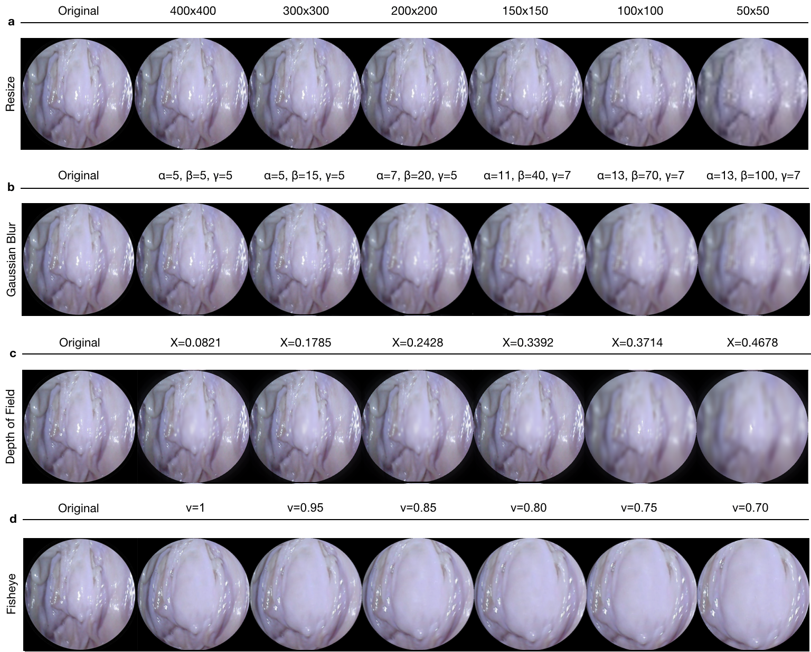

# Endo-SLAM Dataset
In this repository, endoscopy image dataset and the codes to manipulte these images and how these modifications affect the visual odometry algorithms will be introduced. 

<p align="center">
  
</p>

To watch the full version of the video, please visit [https://www.youtube.com/watch?v=G_LCe0aWWdQ](https://www.youtube.com/watch?v=G_LCe0aWWdQ)

If you use this code and dataset, please cite:

>    Kutsev Bengisu Ozyoruk, Kagan Incetan, Gulfize Coskun, Guliz Irem Gokceler,  Yasin Almalioglu, Faisal Mahmood, Nicholas J. Durr, Eva Curto, Luis Perdigoto, Marina Oliveira, Helder Araujo, Henrique Alexandrino, Mehmet Turan. "Quantitative Evaluation of Endoscopic SLAM 
Methods: ENDO-SLAM Dataset.". 

## Overview

We introduce a comprehensive endoscopic SLAM dataset containing both capsule and standard endoscopy recordings.

In total, 35 sub-datasets are provided: 18 sub-datasets for colon, 12 sub-datasets for stomach and five sub-datasets for small intestine, whereas four of these contain polyp-mimicking elevations carried out by an expert gastroenterologist. 

### Contributions

The experimentally collected dataset is designed to meet the following major requirements for scientific research and development of endoscopic SLAM methods:
  - Time-synchronized, ground-truth 6 DoF pose data
  - High precision, ground-truth 3D reconstructions
  - Multiple organs from multiple individuals
  - Images from cameras with differing optical properties
  - Image sequences with differing native frame rates
  - A variety of lighting conditions
  - Distinguishable features of diagnostic significance (e.g. presence/absence of polyps)
  
### Equipment

The equipment employed during generation of the dataset from eight ex-vivo porcine GI-tract organs as following:

<p align="center">
 
</p>

**a** Franka Emika Panda: robotic arm employed as motion device. **b** Capsule Holder: special production two-piece holder used as a medium between the WCE cameras and the robotic arm. **c** MiroCam Data Belt PillCam capsule endoscope **d** Real Porcine Colon: sewn onto an 'L' shaped semi-cylindrical scaffold in high-density foam. **e** MiroCam MR1100 receiver: Digital video grabber that converts analog data from receiver into digital to computer. **f** PillCam recorder **g** Artec Eva: 3D scanner used to generate ground truth - ply file.  **h** EinScan Pro 2X: 3D scanner used to generate ground truth - .ply, .obj, .stl and .ASC file. **i** Wireless Endoscope Camera (YPC-HD720P): high resolution - 1280×720 and HD640×480.  **j** Endoscope 3 in 1 Camera: low resolution - 640×480. **k** Camera Holder: special design one-piece holder for the high and low resolution endoscope cameras used to fixed on the robotic arm. **l** PillCam COLON2: WCE double tip camera. **m** MiroCam Regular MC1000-W: WCE camera employed to capture frames from real porcine stomach and send to receiver. 

### Collection of frames taken on endoscope trajectories

<p align="center">
 
</p>

**a** was collected by MiroCam capsule endoscope **b** was acquired by the frontal camera of a Colon-II PillCam capsule **c** was acquired by the high resolution endoscope camera **d** was acquired by the low resolution endoscope camera **e** is synthetically generated data using Unity environment.


### 3D-Scanner Images for Endo-SLAM Dataset

3D-scanner images obtained for six organs which are fixed to scaffolds were cut in O, Z and L shapes to mimic the GI-tract path through the ascending  colon to  the  transverse  colon. 

<p align="center">
 
</p>

**a** shows RGB images of organs **b** shows corresponding 3D reconstruction from .ply files for organs recorded via  3D Scanner.

### 3D Reconstruction and Evaluation Pipeline

<p align="center">
 
</p>

**a** shows input image sequences from Colon-IV, Small Intestine and Stomach-III trajectories which were downsampled to 4 fps and given as input to Scale Invariant Feature Transform (SIFT), separately. **b** shows the final panorama view which was formed by aligning and blending all input images. Specularities are suppressed using inpainting function of OpenCV. **c** shows 3D scanner point cloud data for each organ in ply-format. **d** shows pixel-wise depth values for inpainted images which were predicted using shape from shading. **e** shows the matched area between reference and aligned cloud points by emphasizing it with white dots. Iterative Closest Point(ICP) was used to align the ground truth data and reconstructed surface after manually labelling a common line segment. **f** shows the cloud mesh distances in the form of heatmap with the bar displaying the root mean square error values in terms of cm for color space. The resultant RMSE values for Colon-IV, Small Intestine and Stomach-III are 1.09 cm, 1.02 cm and 1.11 cm, respectively.

### Image Modifications

<p align="center">
 
</p>

**a** Resize **b** Gaussian blur with convolution filter size(α), standard deviation of Gaussian distribution(β) and the number o filtering times(γ) **c** Depth of Field for the focus positions 0.0821, 0.1785, 0.2428, 0.3392, 0.3714, 0.4678 **d** Fish Eye distortion for discarding ratios (ν) for 1, 0.95, 0.85, 0.8, 0.75, 0.7.


## Getting Started

### 1. Installation

- Clone this repo:

```bash
cd ~
git clone https://github.com/CapsuleEndoscope/Endo-SLAM
cd Endo-SLAM
```

### 2. Prerequisites

-Matlab2020a

### 3. Code Base Structure

...

### 4. Dataset Organization

```python
Endo-SLAM-Dataset
| 
└── Cameras            
|     └──PillCam
|     |   ├── Calibration
|     |   ├── Colon-I(L-shaped)
|     |   |   └── TumorfreeTrajectory_i i={1,2,3}
|     |   |   |   ├── Poses
|     |   |   |   └── Frames
|     |   |   └── TumorousTrajectory_i i={4}
|     |   |       ├── Poses
|     |   |       └── Frames
|     |   |
|     |   └── Colon-II(Z-shaped)
|     |       └── TumorfreeTrajectory_i i={1,2}
|     |       |    ├── Poses
|     |       |    └── Frames
|     |       └── TumorousTrajectory_i i={3}
|     |            ├── Poses
|     |            └── Frames
|     └── MiroCam
|     |   ├── Calibration
|     |   └── Colon-III(L-shaped) 
|     |       └──TumorfreeTrajectory_i i={1,3,4,5}
|     |       |   ├── Poses
|     |       |   └── Frames
|     |       └── TumorousTrajectory_i i={6,7}
|     |           ├── Poses
|     |           └── Frames             
|     └── HighCam
|     |   ├── Calibration
|     |   └── Colon-IV, Small Intestine, Stomach-I,II,III
|     |   	└── TumorfreeTrajectory_i i = {1,...,k} 
|     |             ├── Poses       
|     |             └── Frames              
|     └── LowCam
|         ├── Calibration  
|         └── Colon-IV, Small Intestine, Stomach-I,II,III
|         	└── TumorfreeTrajectory_i i = {1,...,k} 
|                   ├── Poses       
|                   └── Frames            
| 
└── Cameras(Modified)
|     └──PillCam, MiroCam, HighCam, LowCam
|         ├── Calibration
|         └── Colon-I,II,III,IV, Small Intestine, Stomach-I,II,III
|               ├── Poses   
|               └── Frames              
| 
└── 3D_Scanners
|     └──Colon-III, Colon-IV, Small Intestine, Stomach-I,II,III 
|         └──(.fig, .obj, .ply, .ASC, .STL)  
|
└── Unity Camera
      ├── Calibration
      └── Colon
          ├── Poses       
          └── Frames 
```

## Results

The SC-SfMLearner algorithm was used to show the use-case of dataset.


## Acknowledgments

...

## Reference

If you find this work useful in your research please consider citing our paper:

```
@article{Bengisu2020,
    title={Quantitative Evaluation of EndoscopicSLAM Methods: ENDO-SLAM Dataset},
    author={Kutsev Bengisu Ozyoruk, Kagan Incetan, Gulfize Coskun, Guliz Irem Gokceler, Yasin Almalioglu, Faisal Mahmood, Nicholas J. Durr, Eva Curto, Luis Perdigoto, Marina Oliveira, Helder Araujo, Henrique Alexandrino, Mehmet Turan},
    journal={arXiv preprint },
    year={2020}
}
